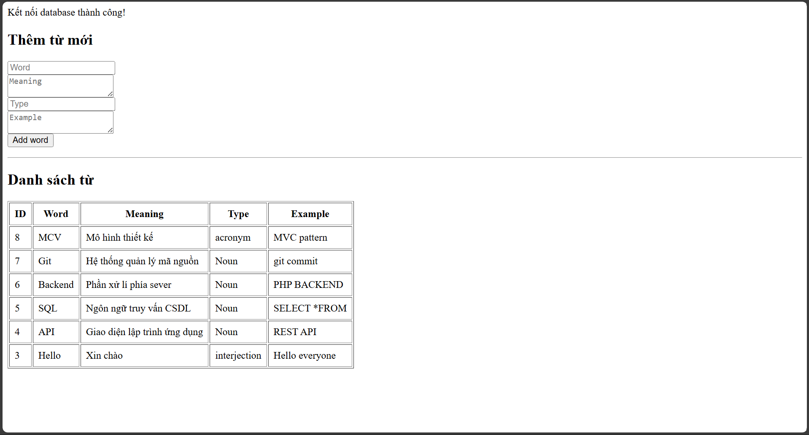

# IT Dictionary Website

A simple IT terminology dictionary website built with PHP & MySQL.

## Features
- Add new IT terms
- Display list of terms
- Search terms by keyword

## Technologies
- PHP
- MySQL
- XAMPP
- Git

## Screenshots

## How to run locally
1. Install XAMPP
2. Clone this repository
3. Put project into htdocs
4. Import database
5. Run at http://localhost/dictionary
