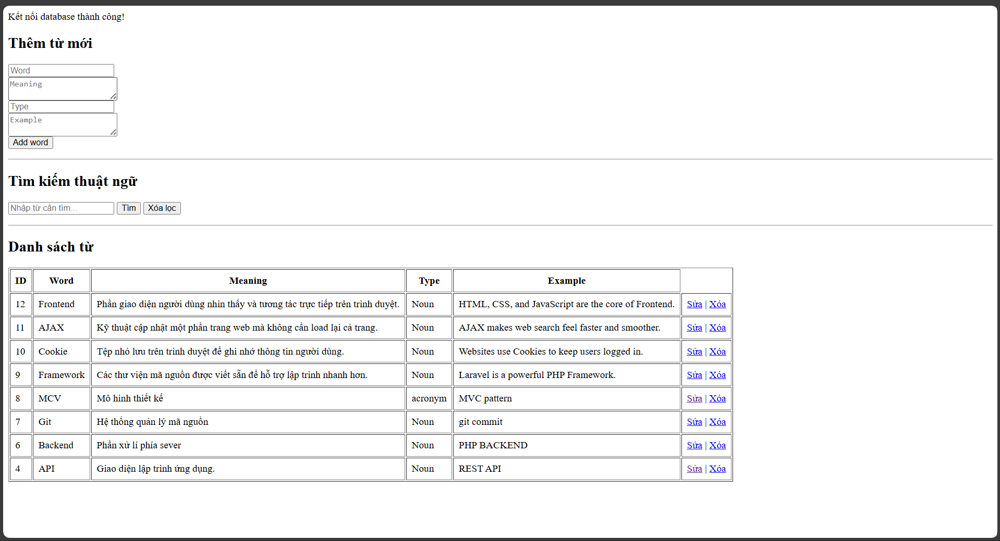

# 📚 Từ Điển Thuật Ngữ CNTT (IT Dictionary)

Một ứng dụng web đơn giản giúp quản lý và tra cứu các thuật ngữ chuyên ngành Công nghệ thông tin. Project được xây dựng để thực hành kỹ năng lập trình Web Backend căn bản.

## 🌟 Tính năng chính
- **Thêm từ mới**: Lưu trữ thuật ngữ, định nghĩa, loại từ và ví dụ minh họa.
- **Danh sách thuật ngữ**: Hiển thị toàn bộ dữ liệu đã lưu từ Database MySQL.
- **Tìm kiếm thông minh**: Tìm kiếm nhanh chóng theo từ khóa (Keyword).

## 🛠 Công nghệ sử dụng
- **Ngôn ngữ**: PHP
- **Cơ sở dữ liệu**: MySQL
- **Công cụ**: XAMPP, VS Code, Git/GitHub

## 📸 Ảnh chụp giao diện

## ⚙️ Hướng dẫn cài đặt (Local)
1. Clone project về máy hoặc tải file Zip.
2. Bỏ thư mục vào đường dẫn `C:\xampp\htdocs\`.
3. Mở **phpMyAdmin**, tạo database tên là `dictionary_db`.
4. Import bảng dữ liệu (hoặc tạo bảng `words` như cấu trúc trong code).
5. Đổi tên file `db.example.php` (nếu có) thành `db.php` và cấu chỉnh thông số kết nối.
6. Truy cập `http://localhost/dictionary` để sử dụng.
